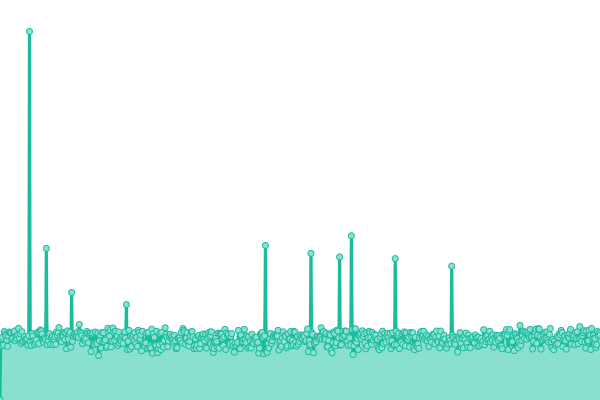
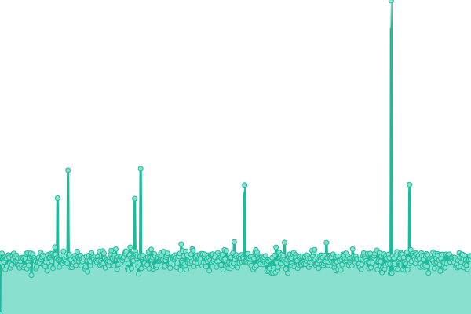
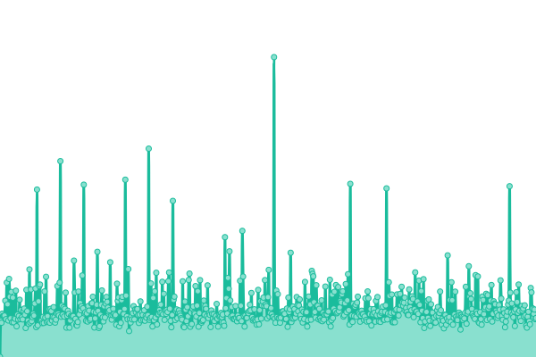
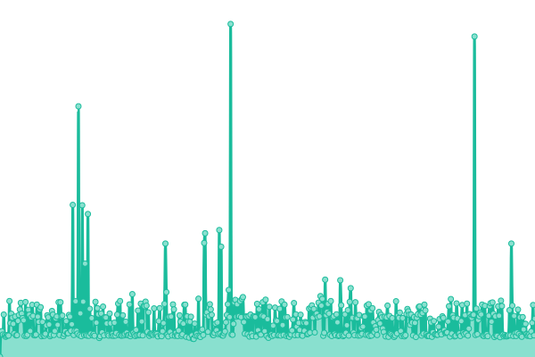
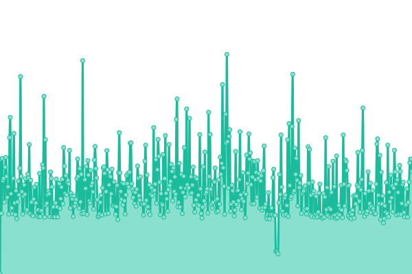
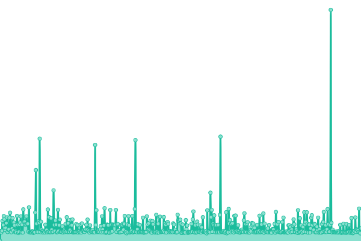
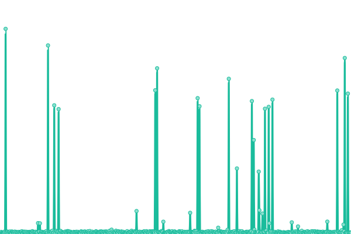

# [📈 Live Status](https://gaeljw.github.io/poc-uptime): <!--live status--> **🟧 Partial outage**

This repository contains the open-source uptime monitor and status page for [Gaël Jourdan-Weil](https://gaeljw.github.io/poc-uptime), powered by [Upptime](https://github.com/upptime/upptime).

With [Upptime](https://upptime.js.org), you can get your own unlimited and free uptime monitor and status page, powered entirely by a GitHub repository. We use [Issues](https://github.com/gaeljw/poc-uptime/issues) as incident reports, [Actions](https://github.com/gaeljw/poc-uptime/actions) as uptime monitors, and [Pages](https://gaeljw.github.io/poc-uptime) for the status page.

<!--start: status pages-->
<!-- This summary is generated by Upptime (https://github.com/upptime/upptime) -->
<!-- Do not edit this manually, your changes will be overwritten -->
<!-- prettier-ignore -->
| URL | Status | History | Response Time | Uptime |
| --- | ------ | ------- | ------------- | ------ |
|  [theGardener](https://thegardener.kelkoogroup.com/) | 🟩 Up | [the-gardener.yml](https://github.com/gaeljw/poc-uptime/commits/HEAD/history/the-gardener.yml) | 

 994ms
     
 | 

<a href="https://gaeljw.github.io/poc-uptime/history/the-gardener">100.00%</a>
    

|  [developers.kkg](https://developers.kelkoogroup.com/) | 🟩 Up | [developers-kkg.yml](https://github.com/gaeljw/poc-uptime/commits/HEAD/history/developers-kkg.yml) | 

 1627ms
     
 | 

<a href="https://gaeljw.github.io/poc-uptime/history/developers-kkg">100.00%</a>
    

|  Test SAPISEARCH | 🟩 Up | [test-sapisearch.yml](https://github.com/gaeljw/poc-uptime/commits/HEAD/history/test-sapisearch.yml) | 

 773ms
     
 | 

<a href="https://gaeljw.github.io/poc-uptime/history/test-sapisearch">100.00%</a>
    

|  Test SAPILM | 🟩 Up | [test-sapilm.yml](https://github.com/gaeljw/poc-uptime/commits/HEAD/history/test-sapilm.yml) | 

 303ms
     
 | 

<a href="https://gaeljw.github.io/poc-uptime/history/test-sapilm">100.00%</a>
    

|  Test SFEEDMERCHANT | 🟥 Down | [test-sfeedmerchant.yml](https://github.com/gaeljw/poc-uptime/commits/HEAD/history/test-sfeedmerchant.yml) | 

 1633ms
     
 | 

<a href="https://gaeljw.github.io/poc-uptime/history/test-sfeedmerchant">99.99%</a>
    

|  Test SFEEDCAT | 🟥 Down | [test-sfeedcat.yml](https://github.com/gaeljw/poc-uptime/commits/HEAD/history/test-sfeedcat.yml) | 

 300ms
     
 | 

<a href="https://gaeljw.github.io/poc-uptime/history/test-sfeedcat">99.99%</a>
    

|  Test SFEED | 🟥 Down | [test-sfeed.yml](https://github.com/gaeljw/poc-uptime/commits/HEAD/history/test-sfeed.yml) | 

 362ms
     
 | 

<a href="https://gaeljw.github.io/poc-uptime/history/test-sfeed">100.00%</a>
    

|  Test ReportingAPI | 🟩 Up | [test-reporting-api.yml](https://github.com/gaeljw/poc-uptime/commits/HEAD/history/test-reporting-api.yml) | 

 2181ms
     
 | 

<a href="https://gaeljw.github.io/poc-uptime/history/test-reporting-api">99.63%</a>
    

<!--end: status pages-->

[**Visit our status website →**](https://gaeljw.github.io/poc-uptime)

## 📄 License

- Powered by: [Upptime](https://github.com/upptime/upptime)
- Code: [MIT](./LICENSE) © [Gaël Jourdan-Weil](https://gaeljw.github.io/poc-uptime)
- Data in the `./history` directory: [Open Database License](https://opendatacommons.org/licenses/odbl/1-0/)
